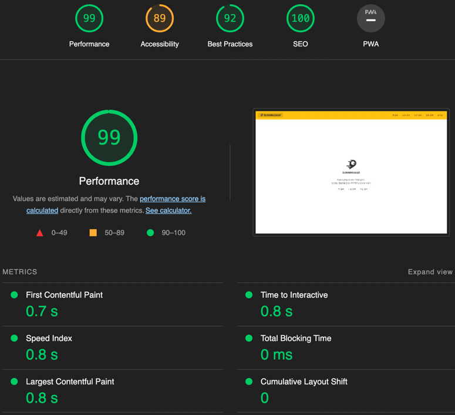

# 안정적인 서비스 만들기

## 1단계 - 화면 응답 개선하기

### 요구사항
- [x] 부하테스트 각 시나리오의 요청시간을 목푯값 이하로 개선
  - [x] k6
    <details>
    <summary>접기/펼치기</summary>
  
    - Smoke Test
      ```
        execution: local
        script: subway-k6-test.js
        output: -
      
        scenarios: (100.00%) 1 scenario, 1 max VUs, 31s max duration (incl. graceful stop):
        * default: 1 looping VUs for 1s (gracefulStop: 30s)
      
      
      running (01.3s), 0/1 VUs, 1 complete and 0 interrupted iterations
      default ✓ [======================================] 1 VUs  1s
      
           ✓ main status was 200
           ✓ join status was 201
           ✓ login status was 200
           ✓ favorite status was 200
           ✓ path status was 200
      
           checks.........................: 100.00% ✓ 5        ✗ 0  
           data_received..................: 7.2 kB  5.6 kB/s
           data_sent......................: 1.2 kB  943 B/s
           http_req_blocked...............: avg=47.63ms  min=0s     med=0s       max=238.16ms p(90)=142.89ms p(95)=190.52ms
           http_req_connecting............: avg=801.99µs min=0s     med=0s       max=4.01ms   p(90)=2.4ms    p(95)=3.2ms   
           http_req_duration..............: avg=209.38ms min=9.27ms med=215.43ms max=393.42ms p(90)=337.69ms p(95)=365.56ms
             { expected_response:true }...: avg=209.38ms min=9.27ms med=215.43ms max=393.42ms p(90)=337.69ms p(95)=365.56ms
           http_req_failed................: 0.00%   ✓ 0        ✗ 5  
           http_req_receiving.............: avg=51.8µs   min=41µs   med=54µs     max=61µs     p(90)=59µs     p(95)=60µs    
           http_req_sending...............: avg=147.4µs  min=52µs   med=138µs    max=235µs    p(90)=224.2µs  p(95)=229.59µs
           http_req_tls_handshaking.......: avg=5.1ms    min=0s     med=0s       max=25.5ms   p(90)=15.3ms   p(95)=20.4ms  
           http_req_waiting...............: avg=209.18ms min=9ms    med=215.16ms max=393.23ms p(90)=337.51ms p(95)=365.37ms
           http_reqs......................: 5       3.880011/s
           iteration_duration.............: avg=1.28s    min=1.28s  med=1.28s    max=1.28s    p(90)=1.28s    p(95)=1.28s   
           iterations.....................: 1       0.776002/s
           vus............................: 1       min=1      max=1
           vus_max........................: 1       min=1      max=1
      ```
  
    - Load Test
      ```
        execution: local
        script: subway-k6-test.js
        output: -
      
        scenarios: (100.00%) 1 scenario, 100 max VUs, 1m40s max duration (incl. graceful stop):
        * default: Up to 100 looping VUs for 1m10s over 7 stages (gracefulRampDown: 30s, gracefulStop: 30s)
      
      
      running (1m10.1s), 000/100 VUs, 8970 complete and 0 interrupted iterations
      default ✓ [======================================] 000/100 VUs  1m10s
      
           ✓ main status was 200
           ✓ join status was 201
           ✓ login status was 200
           ✓ favorite status was 200
           ✓ path status was 200
      
           checks.........................: 100.00% ✓ 44850     ✗ 0    
           data_received..................: 23 MB   335 kB/s
           data_sent......................: 5.5 MB  79 kB/s
           http_req_blocked...............: avg=47.22µs  min=0s      med=0s       max=37.25ms  p(90)=1µs      p(95)=1µs     
           http_req_connecting............: avg=8.81µs   min=0s      med=0s       max=12.4ms   p(90)=0s       p(95)=0s      
           http_req_duration..............: avg=92.8ms   min=2.76ms  med=38.66ms  max=919.27ms p(90)=276.24ms p(95)=368.84ms
             { expected_response:true }...: avg=92.8ms   min=2.76ms  med=38.66ms  max=919.27ms p(90)=276.24ms p(95)=368.84ms
           http_req_failed................: 0.00%   ✓ 0         ✗ 44850
           http_req_receiving.............: avg=21.73µs  min=5µs     med=17µs     max=1.56ms   p(90)=35µs     p(95)=47µs    
           http_req_sending...............: avg=48.72µs  min=9µs     med=42µs     max=2.42ms   p(90)=77µs     p(95)=94µs    
           http_req_tls_handshaking.......: avg=37.62µs  min=0s      med=0s       max=22.62ms  p(90)=0s       p(95)=0s      
           http_req_waiting...............: avg=92.73ms  min=2.71ms  med=38.56ms  max=919.18ms p(90)=276.2ms  p(95)=368.77ms
           http_reqs......................: 44850   640.0662/s
           iteration_duration.............: avg=464.65ms min=72.49ms med=426.13ms max=1.68s    p(90)=856.42ms p(95)=972.94ms
           iterations.....................: 8970    128.01324/s
           vus............................: 11      min=1       max=100
           vus_max........................: 100     min=100     max=100
      
      ```
  
    - Stress Test
      ```
        execution: local
        script: subway-k6-test.js
        output: -
      
        scenarios: (100.00%) 1 scenario, 400 max VUs, 1m40s max duration (incl. graceful stop):
        * default: Up to 400 looping VUs for 1m10s over 7 stages (gracefulRampDown: 30s, gracefulStop: 30s)
      
      
      running (1m10.3s), 000/400 VUs, 9260 complete and 0 interrupted iterations
      default ✓ [======================================] 000/400 VUs  1m10s
      
           ✓ main status was 200
           ✓ join status was 201
           ✓ login status was 200
           ✓ favorite status was 200
           ✓ path status was 200
      
           checks.........................: 100.00% ✓ 46300      ✗ 0    
           data_received..................: 26 MB   363 kB/s
           data_sent......................: 5.8 MB  83 kB/s
           http_req_blocked...............: avg=165.29µs min=0s      med=0s       max=232.52ms p(90)=1µs      p(95)=1µs  
           http_req_connecting............: avg=32.52µs  min=0s      med=0s       max=14.31ms  p(90)=0s       p(95)=0s   
           http_req_duration..............: avg=347.96ms min=2.18ms  med=109.32ms max=3.68s    p(90)=984.76ms p(95)=1.12s
             { expected_response:true }...: avg=347.96ms min=2.18ms  med=109.32ms max=3.68s    p(90)=984.76ms p(95)=1.12s
           http_req_failed................: 0.00%   ✓ 0          ✗ 46300
           http_req_receiving.............: avg=16.86µs  min=5µs     med=13µs     max=12.12ms  p(90)=20µs     p(95)=31µs 
           http_req_sending...............: avg=35.06µs  min=9µs     med=31µs     max=3.08ms   p(90)=51µs     p(95)=64µs 
           http_req_tls_handshaking.......: avg=127.21µs min=0s      med=0s       max=85.75ms  p(90)=0s       p(95)=0s   
           http_req_waiting...............: avg=347.91ms min=2.15ms  med=109.28ms max=3.68s    p(90)=984.71ms p(95)=1.12s
           http_reqs......................: 46300   658.859499/s
           iteration_duration.............: avg=1.74s    min=75.72ms med=1.77s    max=6.29s    p(90)=3.16s    p(95)=3.38s
           iterations.....................: 9260    131.7719/s
           vus............................: 55      min=5        max=400
           vus_max........................: 400     min=400      max=400
      ```
  
    </details>
    

### 개선
- Reverse Proxy 개선하기
  - [x] gzip 압축
    <details>
    <summary>접기/펼치기</summary>

    nginx.conf
    ```
    http {
      gzip on; ## http 블록 수준에서 gzip 압축 활성화
      gzip_comp_level 9;
      gzip_vary on;
      gzip_types text/plain text/css application/json application/x-javascript application/javascript text/xml application/xml application/rss+xml text/javascript image/svg+xml application/vnd.ms-fontobject application/x-font-ttf font/opentype;
    }
    ```
    </details>

  - [x] cache
    <details>
    <summary>접기/펼치기</summary>

    nginx.conf
    ```
    http {
      ## Proxy 캐시 파일 경로, 메모리상 점유할 크기, 캐시 유지기간, 전체 캐시의 최대 크기 등 설정
      proxy_cache_path /tmp/nginx levels=1:2 keys_zone=mycache:10m inactive=10m max_size=200M;
   
      ## 캐시를 구분하기 위한 Key 규칙
      proxy_cache_key "$scheme$host$request_uri $cookie_user";
   
      server {
        location ~* \.(?:css|js|gif|png|jpg|jpeg)$ {
          proxy_pass http://app;
         
          ## 캐시 설정 적용 및 헤더에 추가
          # 캐시 존을 설정 (캐시 이름)
          proxy_cache mycache;
          # X-Proxy-Cache 헤더에 HIT, MISS, BYPASS와 같은 캐시 적중 상태정보가 설정
          add_header X-Proxy-Cache $upstream_cache_status;
          # 200 302 코드는 20분간 캐싱
          proxy_cache_valid 200 302 10m;    
          # 만료기간을 1 달로 설정
          expires 1M;
          # access log 를 찍지 않는다.
          access_log off;
        }
      }
    }
    ```
    </details>

  - [x] TLS, HTTP/2 설정
    <details>
    <summary>접기/펼치기</summary>

    인증서 발급
      - domain
          - CertBot

            Let's Encrypt 인증서를 자동으로 발급 및 갱신을 해주는 봇 프로그램
            ```shell
            $ cd reverse-proxy/domain
            $ curl -L https://raw.githubusercontent.com/wmnnd/nginx-certbot/master/init-letsencrypt.sh > init-letsencrypt.sh
            $ chmod +x init-letsencrypt.sh
            $ vi init-letsencrypt.sh
            // 도메인, 이메일, 디렉토리 수정
            $ sudo ./init-letsencrypt.sh // 인증서 발급
            $ docker-compose up -d
            ```
          - 설정 파일
              - [nginx.conf](../reverse-proxy/domain/nginx/conf/nginx.conf)
              - [docker-compose](../reverse-proxy/domain/docker-compose.yml)
              - [init-letsencrypt.sh](../reverse-proxy/domain/init-letsencrypt.sh)

      - localhost
          - minica 사용해서 localhost 인증서 생성
            ```shell
            $ cd reverse-proxy/localhost
            $ brew install minica
            $ minica -domains www.localhost,localhost -ip-addresses 127.0.0.1
            $ ls -al
            -rw-------   1 joohokim  staff  1675 Jul  7 23:30 minica-key.pem
            -rw-------   1 joohokim  staff  1204 Jul  7 23:30 minica.pem
            drwx------   4 joohokim  staff   128 Jul  7 23:30 www.localhost
            ```
          - nginx build & run
            ```shell
            $ docker build -t proxy .
            $ docker run -d -p 80:80 -p 443:443 --name proxy proxy
            ```
          - 설정 파일
              - [nginx.conf](../reverse-proxy/localhost/nginx/conf/nginx.conf)
              - [Dockerfile](../reverse-proxy/localhost/Dockerfile)

    nginx.conf
    ```
    http {
      server {
        listen 80;
        return 301 https://$host$request_uri;
      }
      server {  
        listen 443 ssl http2;
   
        ssl_certificate <인증서 파일 경로>
        ssl_certificate_key <인증서 키 파일 경로>;
   
        # Disable SSL
        ssl_protocols TLSv1 TLSv1.1 TLSv1.2;
   
        # 통신과정에서 사용할 암호화 알고리즘
        ssl_prefer_server_ciphers on;
        ssl_ciphers ECDH+AESGCM:ECDH+AES256:ECDH+AES128:DH+3DES:!ADH:!AECDH:!MD5;
   
        # Enable HSTS
        # client의 browser에게 http로 어떠한 것도 load 하지 말라고 규제합니다.
        # 이를 통해 http에서 https로 redirect 되는 request를 minimize 할 수 있습니다.
        add_header Strict-Transport-Security "max-age=31536000" always;
        
        # SSL sessions
        ssl_session_cache shared:SSL:10m;
        ssl_session_timeout 10m; 
      }
    }
    ```
    </details>

- WAS 성능 개선하기
  - [x] Spring Data Cache
    - local redis 실행
      <details>
      <summary>접기/펼치기</summary>
      
        ```shell
        $ cd redis
        $ docker-compose up -d
        ```
      </details>
    - Service layer 에 적용
      - 역 목록 조회
      - 노선 목록 조회
      - 노선 조회
      - 경로 조회

- Scale out - 초간단 Blue-Green 배포 구성하기
  - [nomad](https://learn.hashicorp.com/nomad) & [consul](https://learn.hashicorp.com/consul)

    <details>
    <summary>접기/펼치기</summary>

    - 애플리케이션 배포 및 관리를 위한 오케스트레이션 도구
    - task driver 로 docker 를 사용하도록 설정해둬서 docker 가 설치되어 있어야 함
    - 설치
      - macOS
        ```shell
        $ brew tap hashicorp/tap
        $ brew install hashicorp/tap/nomad
        $ brew install hashicorp/tap/consul
        ```
        - file sharing
          - Docker > Preferences > Resources > File sharing 에서 프로젝트 디렉터리가 포함되도록 설정
          - nomad/start_agents.sh 에서 에이전트 실행 시 data-dir, alloc-dir 를 ./nomad 하위로 설정함

      - linux
        ```shell
        $ curl -fsSL https://apt.releases.hashicorp.com/gpg | sudo apt-key add -
        $ sudo apt-add-repository "deb [arch=amd64] https://apt.releases.hashicorp.com $(lsb_release -cs) main"
        $ sudo apt-get update && sudo apt-get install nomad

        $ curl -fsSL https://apt.releases.hashicorp.com/gpg | sudo apt-key add -
        $ sudo apt-add-repository "deb [arch=amd64] https://apt.releases.hashicorp.com $(lsb_release -cs) main"
        $ sudo apt-get update && sudo apt-get install consul
        ```

    - agent 실행
      - network interface 확인
        ```shell
        $ ip a
        ```
      - nomad agent network-interface 설정
        ```shell
        $ cd nomad
        $ vi start_agents.sh
        nomad agent -network-interface="eno2"
        ```
      - agent 시작
        ```shell
        $ cd nomad
        $ ./start_agents.sh
        
        $ nomad node status
        ID        DC   Name    Class   Drain  Eligibility  Status
        92fba198  dc1  ubuntu  <none>  false  eligible     ready
        
        $ nomad server members
        Name           Address         Port  Status  Leader  Raft Version  Build  Datacenter  Region
        ubuntu.global  192.168.50.100  4648  alive   true    3             1.3.2  dc1         global
        
        $ consul members
        Node    Address         Status  Type    Build   Protocol  DC   Partition  Segment
        ubuntu  127.0.0.1:8301  alive   server  1.12.3  2         dc1  default    <all>
        ```

    - redis, mysql 배포
      ```shell
      $ cd nomad
      $ nomad job run redis.nomad
      $ nomad job run mysql.nomad

      $ nomad status cache
      ...
      Allocations
      ID        Node ID   Task Group  Version  Desired  Status    Created     Modified
      5dd700c5  ff145549  cache       0        run      running   2m59s ago   2m43s ago
      
      $ nomad status database
      ...
      Allocations
      ID        Node ID   Task Group  Version  Desired  Status    Created     Modified
      1646bc92  ff145549  database    0        run      running   3m48s ago   3m32s ago

      $ consul catalog services
      cache-redis
      consul
      database-mysql
      nomad
      nomad-client
      ```

    - application 배포
      - build docker image
        ```shell
        $ ./gradlew jibDockerBuild
        $ docker images
        REPOSITORY                             TAG       IMAGE ID       CREATED         SIZE
        give928/infra-subway-performance       0.0.1     16d90f2739b3   3 hours ago     164MB
        give928/infra-subway-performance       latest    16d90f2739b3   3 hours ago     164MB
        ```
      - nomad 작업 파일에 이미지 설정
        ```shell
        $ cd nomad
        $ vi subway.nomad
        ...
        config {
           image = "give928/infra-subway-performance:0.0.1"
        ...
        ```
      - nomad 작업 실행하고 상태 확인
        ```shell
        $ nomad job run subway.nomad
        ==> 2022-07-19T13:22:38Z: Monitoring evaluation "7fbb7541"
        2022-07-19T13:22:38Z: Evaluation triggered by job "subway"
        2022-07-19T13:22:38Z: Allocation "a1b34146" created: node "92fba198", group "subway"
        2022-07-19T13:22:39Z: Evaluation within deployment: "3de1c25c"
        2022-07-19T13:22:39Z: Allocation "a1b34146" status changed: "pending" -> "running" (Tasks are running)
        2022-07-19T13:22:39Z: Evaluation status changed: "pending" -> "complete"
        ==> 2022-07-19T13:22:39Z: Evaluation "7fbb7541" finished with status "complete"
        
        $ nomad status subway
        ...
        Deployed
        Task Group  Desired  Placed  Healthy  Unhealthy  Progress Deadline
        subway      1        1       1        0          2022-07-19T13:33:01Z
        
        Allocations
        ID        Node ID   Task Group  Version  Desired  Status   Created  Modified
        a1b34146  92fba198  subway      0        run      running  41s ago  18s ago
        
        $ nomad alloc logs a1b34146
          .   ____          _            __ _ _
         /\\ / ___'_ __ _ _(_)_ __  __ _ \ \ \ \
         ( ( )\___ | '_ | '_| | '_ \/ _` | \ \ \ \
         \\/  ___)| |_)| | | | | || (_| |  ) ) ) )
         '  |____| .__|_| |_|_| |_\__, | / / / /
         =========|_|==============|___/=/_/_/_/
         :: Spring Boot ::       (v2.4.0-SNAPSHOT)
        ...
        ```
      - scale out
        - 컨테이너 개수 확장(1 -> 3)
          ```shell
          $ vi subway.nomad
          ...
          - count = 1
          + count = 3

            update {
          -   max_parallel     = 1
          +   max_parallel     = 2
          ...
          ```
        - 작업 계획 확인(2개 생성, 1개 업데이트)
          ```shell
          $ nomad job plan subway.nomad
          +/- Job: "subway"
          +/- Task Group: "subway" (2 create, 1 in-place update)
            +/- Count: "1" => "3" (forces create)
            +/- Update {
                  AutoPromote:      "false"
                  AutoRevert:       "false"
                  Canary:           "0"
                  HealthCheck:      "checks"
                  HealthyDeadline:  "60000000000"
              +/- MaxParallel:      "1" => "2"
                  MinHealthyTime:   "10000000000"
                  ProgressDeadline: "600000000000"
                }
                Task: "subway"
          
          Scheduler dry-run:
          - All tasks successfully allocated.
          
          Job Modify Index: 93
          To submit the job with version verification run:
          
          nomad job run -check-index 93 subway.nomad
          ...
          ```
        - 작업 실행 명령을 복사해서 실행
          ```shell
          $ nomad job run -check-index 93 subway.nomad
          ==> 2022-07-19T13:25:48Z: Monitoring evaluation "0c85691c"
          2022-07-19T13:25:48Z: Evaluation triggered by job "subway"
          2022-07-19T13:25:49Z: Evaluation within deployment: "469f2912"
          2022-07-19T13:25:49Z: Allocation "21f2215e" created: node "92fba198", group "subway"
          2022-07-19T13:25:49Z: Allocation "bd28af40" created: node "92fba198", group "subway"
          2022-07-19T13:25:49Z: Allocation "a1b34146" modified: node "92fba198", group "subway"
          2022-07-19T13:25:49Z: Evaluation status changed: "pending" -> "complete"
          ==> 2022-07-19T13:25:49Z: Evaluation "0c85691c" finished with status "complete"
          
          $ nomad status subway
          Deployed
          Task Group  Desired  Placed  Healthy  Unhealthy  Progress Deadline
          subway      3        3       3        0          2022-07-19T13:36:15Z
          
          Allocations
          ID        Node ID   Task Group  Version  Desired  Status   Created    Modified
          21f2215e  92fba198  subway      1        run      running  29s ago    9s ago
          bd28af40  92fba198  subway      1        run      running  29s ago    3s ago
          a1b34146  92fba198  subway      1        run      running  3m39s ago  19s ago
          ```
      - Update the application version
        - build.gradle 파일에서 image 버전 번경
          ```
          jib {
              ...
              to {
                  image = 'give928/infra-subway-performance'
          -       tags = ['0.0.1']
          +       tags = ['0.0.2']
              }
              ...
          ```
        - build docker image

          프로젝트 루트로 이동해서 실행
          ```shell
          $ ./gradlew jibDockerBuild
          $ docker images
          REPOSITORY                             TAG       IMAGE ID       CREATED          SIZE
          give928/infra-subway-performance       0.0.2     ae74a535c983   11 seconds ago   164MB
          give928/infra-subway-performance       latest    ae74a535c983   11 seconds ago   164MB
          give928/infra-subway-performance       0.0.1     5a114be01b1a   50 seconds ago   164MB
          ```
        - 작업 파일 image 버전 변경
          ```shell
          $ cd nomad
          $ vi subway.nomad
          ...
          config {
          - image = "give928/infra-subway-performance:0.0.1"
          + image = "give928/infra-subway-performance:0.0.2"
          }
          ...
          ```
        - 작업 계획 확인(2개 생성/삭제 업데이트, 1개 무시)
          ```shell
          $ nomad job plan subway.nomad
          +/- Job: "subway"
          +/- Task Group: "subway" (2 create/destroy update, 1 ignore)
            +/- Task: "subway" (forces create/destroy update)
              +/- Config {
                +/- image:    "give928/infra-subway-performance:0.0.1" => "give928/infra-subway-performance:0.0.2"
                    ports[0]: "http"
                  }
          
          Scheduler dry-run:
          - All tasks successfully allocated.
          
          Job Modify Index: 105
          To submit the job with version verification run:
          
          nomad job run -check-index 105 subway.nomad
          ...
          ```
        - 작업 실행 명령을 복사해서 실행하면 롤링 업데이트 실행
          ```shell
          $ nomad job run -check-index 105 subway.nomad
          ==> 2022-07-19T13:32:02Z: Monitoring evaluation "3d6bf256"
          2022-07-19T13:32:02Z: Evaluation triggered by job "subway"
          2022-07-19T13:32:03Z: Evaluation within deployment: "be611a22"
          2022-07-19T13:32:03Z: Allocation "0bce9c66" created: node "92fba198", group "subway"
          2022-07-19T13:32:03Z: Allocation "228641d3" created: node "92fba198", group "subway"
          2022-07-19T13:32:03Z: Evaluation status changed: "pending" -> "complete"
          ==> 2022-07-19T13:32:03Z: Evaluation "3d6bf256" finished with status "complete"
          
          $ nomad status subway
          Deployed
          Task Group  Desired  Placed  Healthy  Unhealthy  Progress Deadline
          subway      3        3       3        0          2022-07-19T13:42:49Z
          
          Allocations
          ID        Node ID   Task Group  Version  Desired  Status    Created     Modified
          aeefc305  92fba198  subway      2        run      running   42s ago     16s ago
          0bce9c66  92fba198  subway      2        run      running   1m3s ago    44s ago
          228641d3  92fba198  subway      2        run      running   1m3s ago    42s ago
          21f2215e  92fba198  subway      1        stop     complete  7m16s ago   1m2s ago
          bd28af40  92fba198  subway      1        stop     complete  7m16s ago   42s ago
          a1b34146  92fba198  subway      1        stop     complete  10m26s ago  1m2s ago
          ```

    - nginx 배포
      - 인증서 설정
          - nomad/data/nginx 경로에 인증서 복사
          - 인증서 파일명 설정
        ```shell
        $ vi nginx.nomad
        ...
          ssl_certificate /etc/nginx/conf.d/cert.pem;
          ssl_certificate_key /etc/nginx/conf.d/key.pem;
        ...
        template {
          source        = "../../../data/nginx/cert.pem"
          destination   = "local/cert.pem"
          change_mode   = "signal"
          change_signal = "SIGINT"
        }
        ```
      - nomad 작업 실행하고 상태 확인
        ```shell
        $ nomad job run nginx.nomad

        $ nomad status nginx
        ...
        Allocations
        ID        Node ID   Task Group  Version  Desired  Status   Created    Modified
        54b4e62e  ff145549  nginx       0        run      running  1m11s ago  57s ago
        ```
      - 로드 밸런서 설정 확인
        ```shell
        $ nomad alloc fs 54b nginx/local/load-balancer.conf
        ...
        upstream backend {
          server 192.168.50.100:25191;
          server 192.168.50.100:31133;
          server 192.168.50.100:21159;
        }
        ...
        ```
  </details>


- 정적 파일 경량화
  - [x] 렌더링 차단 리소스 제거하기
  - [x] dynamic import 사용해서 리소스 지연 로딩 적용
  - [x] 누적 레이아웃 이동 최적화
  - [x] 웹폰트 로드 중에 텍스트가 계속 표시되도록 하기
  - [x] 웹 폰트 최적화
  - [x] Code Splitting
  - [x] 번들 크기 줄이기
    - vuetify-loader treeshaking 적용


