# 안정적인 서비스 만들기

## 2단계 - 조회 성능 개선하기

### 쿼리 최적화

#### 실습환경 세팅
```shell
$ docker run -d -p 23306:3306 brainbackdoor/data-tuning:0.0.3
```
workbench를 설치한 후 localhost:23306 (ID : user, PW : password) 로 접속합니다.

#### 요구사항
- [x] 활동중인(Active) 부서의 현재 부서관리자(manager) 중 연봉 상위 5위안에 드는 사람들이 최근에 각 지역별로 언제 퇴실(O)했는지 조회해보세요.(사원번호, 이름, 연봉, 직급명, 지역, 입출입구분, 입출입시간)
- [x] 인덱스 설정을 추가하지 않고 1s 이하로 반환합니다.
  - M1의 경우엔 시간 제약사항을 달성하기 어렵습니다. 2배를 기준으로 해보시고 어렵다면, 일단 리뷰요청 부탁드려요
- 급여 테이블의 사용여부 필드는 사용하지 않습니다. 현재 근무중인지 여부는 종료일자 필드로 판단해주세요.
  <details>
  <summary>접기/펼치기</summary>

  - 인덱스 설정 전
    ```mysql
    select e.id,
           e.last_name,
           e.annual_income,
           p.position_name,
           r.time,
           r.region,
           r.record_symbol
    from (select e.id,
                 e.last_name,
                 s.annual_income
          from tuning.department as d
               inner join tuning.manager as m on m.department_id = d.id
               inner join tuning.employee as e on e.id = m.employee_id
               inner join tuning.salary as s on s.id = e.id and s.start_date <= now() and s.end_date >= now()
          where d.note = 'Active'
          order by s.annual_income desc
          limit 5) as e
         inner join tuning.position as p on p.id = e.id and p.start_date <= now() and p.end_date >= now()
         inner join tuning.record as r on r.employee_id = e.id and r.record_symbol = 'O'
    # 0.298 sec / 0.000021 sec
    # cost: 23,131.92
    ```
    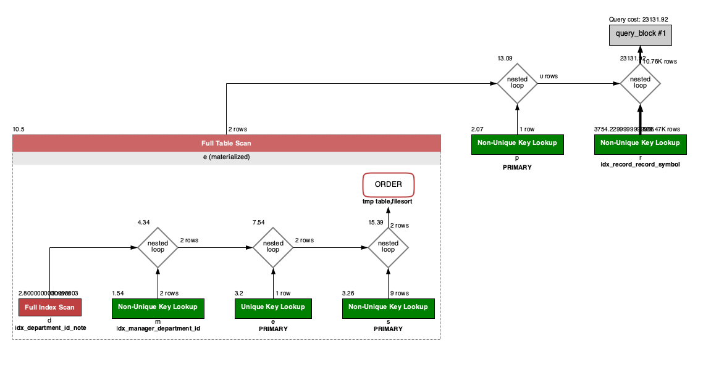
  
  - record 테이블에 fk 추가
    ```mysql
    alter table tuning.record
        add constraint fk_record_employee_id
            foreign key (employee_id)
                references tuning.employee (id);
    
    # 0.0075 sec / 0.000024 sec  
    # cost: 14.72
    ```
    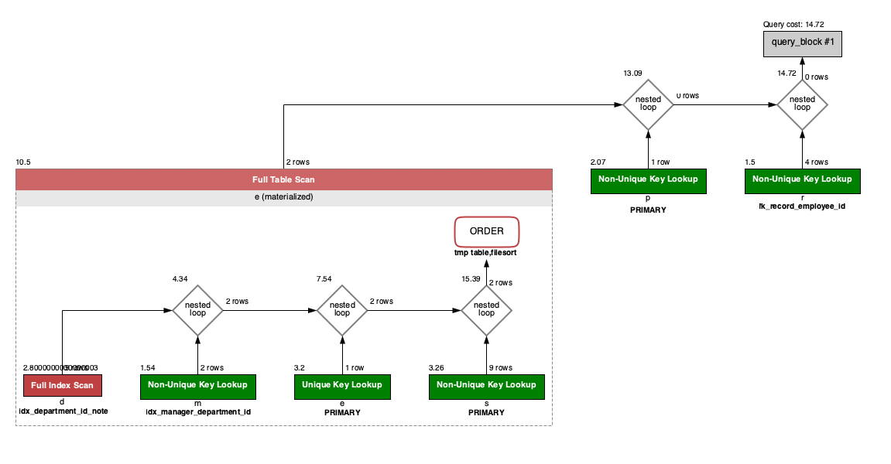
  </details>

### 인덱스 설계

#### 실습환경 세팅
```shell
$ docker run -d -p 13306:3306 brainbackdoor/data-subway:0.0.2
```
workbench를 설치한 후 localhost:13306 (ID : root, PW : masterpw) 로 접속합니다.

#### 요구사항

- 주어진 데이터셋을 활용하여 아래 조회 결과를 100ms 이하로 반환
  - [x] [Coding as a Hobby](https://insights.stackoverflow.com/survey/2018#developer-profile-_-coding-as-a-hobby)와 같은 결과를 반환하세요.
    - 인덱스 설정 전
      ```mysql
      select
          hobby,
          round(count(1) / (select count(1) from subway.programmer) * 100, 1) as percent
      from
          subway.programmer
      group by
          hobby 
      order by hobby desc;
      
      # 인덱스 추가 전
      # full table scan query cost: 99,594.00
      # 0.485 sec / 0.000024 sec
      ```
      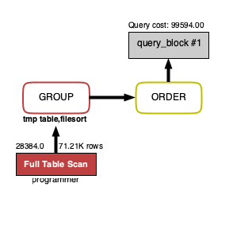
    - 인덱스 설정 후
      ```mysql
      # pk 추가
      alter table subway.programmer add constraint pk_programmer primary key (id);
      # full table scan query cost: 105,549.00
      # 0.352 sec / 0.000052 sec
      
      # index 추가
      alter table subway.programmer add index idx_programmer_hobby (hobby);
      # full index scan query cost: 31,084.00
      # 0.054 sec / 0.000017 sec
      ```
      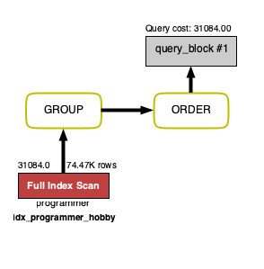

  - [x] 프로그래머별로 해당하는 병원 이름을 반환하세요. (covid.id, hospital.name)
    - 인덱스 설정 전
      ```mysql
      select c.id,
             h.name
      from subway.covid as c
           inner join subway.hospital as h on h.id = c.hospital_id
           inner join subway.programmer as p on p.id = c.programmer_id;
      # join: h -> c -> p
      # cost: 14,406,229,064.40
      # 30 sec over
      ```
      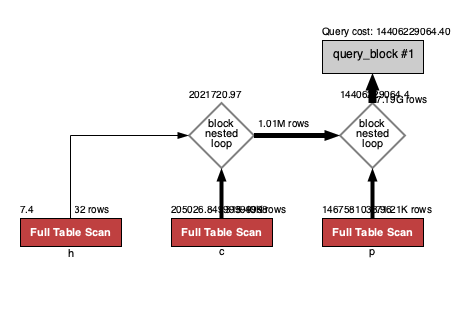
    - 인덱스 설정 후
      ```mysql
      # hospital pk 추가
      alter table subway.hospital add constraint pk_hospital primary key (id);
      # join: c -> h -> p
      # cost: 4,501,768,987.17
      # 0.315 sec / 0.110 sec
      
      # covid pk 추가
      alter table subway.covid add constraint pk_covid primary key (id);
      # join: c -> h -> p
      # cost: 4510461354.88
      # 0.372 sec / 0.049 sec
      
      # programmer pk 추가
      alter table subway.programmer add constraint pk_programmer primary key (id);
      # join: c -> h -> p
      # cost: 824532.60
      # 0.020 sec / 0.00043 sec
      
      # covid programmer_id fk 추가
      alter table subway.covid
    	add constraint fk_covid_programmer_id
    		foreign key (programmer_id)
    			references subway.programmer (id);
      # join: p -> c -> h
      # cost: 605652.22
      # 0.020 sec / 0.00037 sec
      
      # covid hospital_id fk 추가
      alter table subway.covid modify hospital_id int(11);
      
      alter table subway.covid
    	add constraint fk_covid_hospital_id
    		foreign key (hospital_id)
    			references subway.hospital (id);
      # join: p -> c -> h
      # cost: 636346.70
      # 0.018 sec / 0.00033 sec
      ```
      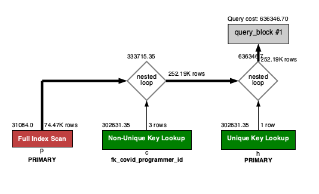

  - [x] 프로그래밍이 취미인 학생 혹은 주니어(0-2년)들이 다닌 병원 이름을 반환하고 user.id 기준으로 정렬하세요. (covid.id, hospital.name, user.Hobby, user.DevType, user.YearsCoding)
    - 인덱스 설정 전
      ```mysql
      select c.id as covid_id,
             h.name as hospital_name,
             p.hobby,
             p.dev_type,
             p.years_coding
      from subway.programmer as p
           inner join subway.covid as c on c.programmer_id = p.id
           inner join subway.hospital as h on h.id = c.hospital_id
      where p.hobby = 'Yes'
        and (p.dev_type = 'Student' or p.years_coding = '0-2 years')
      order by p.id asc;
      # join: h -> p -> c
      # cost: 2,117,430,960,594.31
      # 30 sec over
      ```
      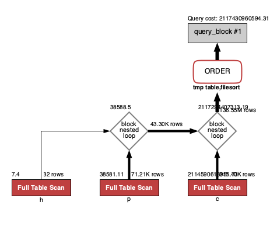
    - 인덱스 설정 후
      ```mysql
      # programmer pk 추가
      alter table subway.programmer add constraint pk_programmer primary key (id);
      # join: h -> c -> p
      # cost: 2,305,578.27
      # 0.828 sec / 0.0059 sec
      
      # covid pk 추가
      alter table subway.covid add constraint pk_covid primary key (id);
      # join: h -> c -> p
      # cost: 2,304,437.06
      # 0.809 sec / 0.0066 sec
      
      # hospital pk 추가
      alter table subway.hospital add constraint pk_hospital primary key (id);
      # join: c -> h -> p
      # cost: 838,329.50
      # 0.695 sec / 0.0057 sec
      
      # covid programmer_id fk 추가
      alter table subway.covid
      add constraint fk_covid_programmer_id
      	foreign key (programmer_id)
      		references subway.programmer (id);
      # join: p -> c -> h
      # cost: 34,479.60
      # 0.022 sec / 0.041 sec
      
      # covid hospital_id fk 추가
      alter table subway.covid modify hospital_id int(11);
      
      alter table subway.covid
      add constraint fk_covid_hospital_id
      	foreign key (hospital_id)
      		references subway.hospital (id);
      # join: p -> c -> h
      # cost: 42,592.88
      # 0.022 sec / 0.035 sec
      
      # programmer hobby index 추가
      alter table subway.programmer add index idx_programmer_hobby (hobby);
      # join: p -> c -> h
      # cost: 41,475.26
      # 0.022 sec / 0.031 sec
      ```
      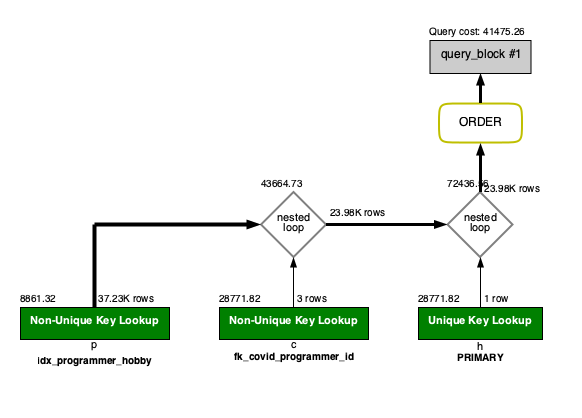

  - [x] 서울대병원에 다닌 20대 India 환자들을 병원에 머문 기간별로 집계하세요. (covid.Stay)
    - 인덱스 설정 전
      ```mysql
      select c.stay, count(1) as covid_count
      from subway.covid as c
      where c.hospital_id = (select h.id
                             from subway.hospital as h
                             where h.name = '서울대병원')
        and c.programmer_id in (select p.id
                                from subway.programmer as p
                                     inner join subway.member as m on m.id = p.member_id and m.age between 20 and 29
                                where p.country = 'India')
      group by c.stay
      order by c.stay;
      # cost: 5,283,231.33
      # 2.181 sec / 0.000029 sec
      
      select c.stay, count(1) as covid_count
      from subway.hospital as h
           inner join subway.covid as c on c.hospital_id = h.id
           inner join subway.programmer as p on p.id = c.programmer_id and p.country = 'India'
           inner join subway.member as m on m.id = c.member_id and m.age between 20 and 29
      where h.name = '서울대병원'
      group by c.stay
      order by c.stay;
      # join: h -> p -> c -> m
      # cost: 1,460,207,450.44
      # 2.608 sec / 0.000019 sec
      
      select STRAIGHT_JOIN c.stay, count(1) as covid_count
      from subway.hospital as h
           inner join subway.covid as c on c.hospital_id = h.id
           inner join subway.programmer as p on p.id = c.programmer_id and p.country = 'India'
           inner join subway.member as m on m.id = c.member_id and m.age between 20 and 29
      where h.name = '서울대병원'
      group by c.stay
      order by c.stay;
      # join: h -> c -> p -> m
      # cost: 182,720,849.73
      # 5.428 sec / 0.000029 sec
      ```
      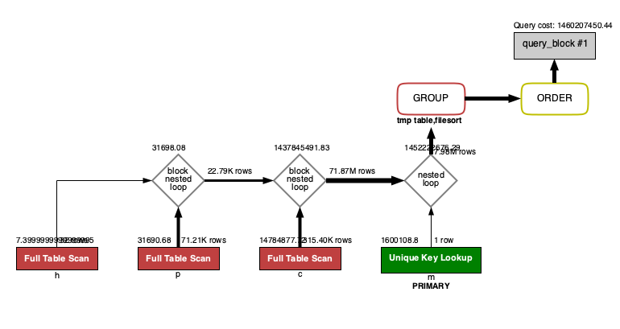
    - 인덱스 설정 후
      ```mysql
      # hospital pk 추가
      alter table subway.hospital add constraint pk_hospital primary key (id);
      # join: h -> c -> m -> p
      # cost: 26,070,276.17
      # 1.649 sec / 0.000034 sec
      
      # covid pk 추가
      alter table subway.covid add constraint pk_covid primary key (id);
      # join: h -> c -> m -> p
      # cost: 26,130,896.00
      # 1.611 sec / 0.000018 sec
      
      # programmer pk 추가
      alter table subway.programmer add constraint pk_programmer primary key (id);
      # join: h -> c -> p -> m
      # cost: 263,421.77
      # 0.183 sec / 0.000016 sec
      
      # covid hospital_id fk 추가
      alter table subway.covid modify hospital_id int(11);
      
      alter table subway.covid
        add constraint fk_covid_hospital_id
            foreign key (hospital_id)
                references subway.hospital (id);
      # join: h -> c -> p -> m
      # cost: 73,726.32
      # 0.092 sec / 0.000013 sec
      
      # covid member_id fk 추가
      alter table subway.covid
        add constraint fk_covid_member_id
            foreign key (member_id)
                references subway.member (id);
      # join: h -> c -> p -> m
      # cost: 73,668.48
      # 0.088 sec / 0.000020 sec
      
      # covid programmer_id fk 추가
      alter table subway.covid
        add constraint fk_covid_programmer_id
            foreign key (programmer_id)
                references subway.programmer (id);
      # join: h -> c -> p -> m
      # cost: 73,938.27
      # 0.092 sec / 0.000017 sec
      
      # programmer member_id fk 추가
      alter table subway.programmer
        add constraint fk_programmer_member_id
            foreign key (member_id)
                references subway.member (id);
      # join: h -> c -> p -> m
      # cost: 73,938.27
      # 0.099 sec / 0.000013 sec
      
      # hopital name index 추가
      alter table subway.hospital
          modify column name varchar(255) character set utf8mb4 collate utf8mb4_general_ci not null;
      
      alter table subway.hospital add index idx_hospital_name (name);
      # join: h -> c -> p -> m
      # cost: 23,104.60
      # 0.087 sec / 0.000012 sec
      ```
      - pk, fk, index 설정 전 optimizer 가 선택한 h -> p -> m -> c 순서로 조인하면 cost 는 167,772,522.03
      - h -> c -> p -> m 순서로 조인하면 cost 는 182,720,849.73
      - h -> c -> m -> p 순서로 조인하면 cost 는 26,070,276.17
      - pk, fk, index 설정 후 h -> c -> p -> m 순서로 조인하면 cost 가 가장 낮다.
      - optimizer 가 h -> c -> m -> p 순서로 조인하는 경우도 있었다. cost 는 h -> c -> p -> m 보다 조금 더 높다.(약 0.5%)
      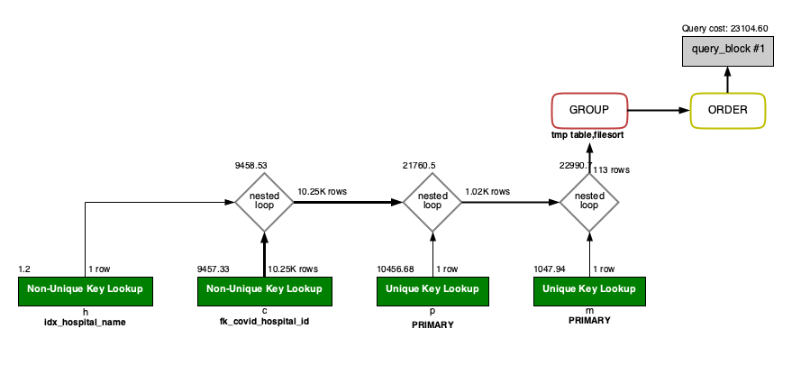

  - [x] 서울대병원에 다닌 30대 환자들을 운동 횟수별로 집계하세요. (user.Exercise)
    - 인덱스 설정 전
      ```mysql
      select STRAIGHT_JOIN p.exercise, count(1) as covid_count
      from subway.hospital as h
           inner join subway.covid as c on c.hospital_id = h.id
           inner join subway.member as m on m.id = c.member_id and m.age between 30 and 39
           inner join subway.programmer as p on p.id = c.programmer_id
      where h.name = '서울대병원'
      group by p.exercise
      order by p.exercise;
      # cost: 240,156,923.10
      # 7.782 sec / 0.000027 sec
      ```
      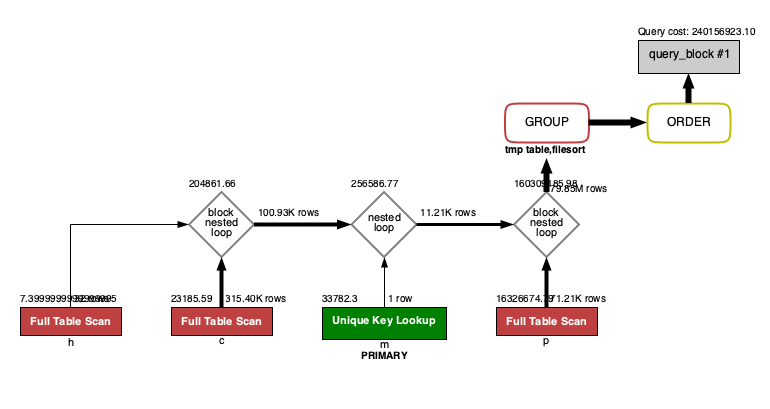
    - 인덱스 설정 후
      ```mysql
      # covid pk 추가
      alter table subway.covid add constraint pk_covid primary key (id);
      # cost: 239,948,238.13
      # 8.079 sec / 0.000020 sec
      
      # programmer pk 추가
      alter table subway.programmer add constraint pk_programmer primary key (id);
      # cost: 273,246.98
      # 0.148 sec / 0.000018 sec
      
      # hospital pk 추가
      alter table subway.hospital add constraint pk_hospital primary key (id);
      # cost: 273,246.98
      # 0.121 sec / 0.000018 sec
      
      # covid hospital_id fk 추가
      alter table subway.covid modify hospital_id int(11);
      
      alter table subway.covid
        add constraint fk_covid_hospital_id
            foreign key (hospital_id)
                references subway.hospital (id);
      # cost: 77,137.87
      # 0.060 sec / 0.000015 sec
      
      # covid member_id fk 추가
      alter table subway.covid
        add constraint fk_covid_member_id
            foreign key (member_id)
                references subway.member (id);
      # cost: 77,551.89
      # 0.054 sec / 0.000012 sec
      
      # covid programmer_id fk 추가
      alter table subway.covid
        add constraint fk_covid_programmer_id
            foreign key (programmer_id)
                references subway.programmer (id);
      # cost: 77,614.02
      # 0.051 sec / 0.000013 sec
      
      # programmer member_id fk 추가
      alter table subway.programmer
        add constraint fk_programmer_member_id
            foreign key (member_id)
                references subway.member (id);
      # cost: 76,166.09
      # 0.069 sec / 0.000012 sec
      
      # hopital name index 추가
      alter table subway.hospital
          modify column name varchar(255) character set utf8mb4 collate utf8mb4_general_ci not null;
      
      alter table subway.hospital add index idx_hospital_name (name);
      # cost: 24,136.83
      # 0.072 sec / 0.000014 sec
      ```
      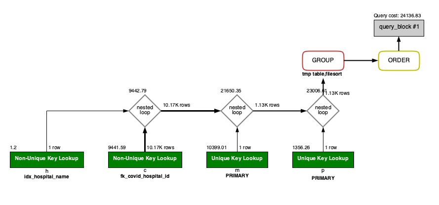
